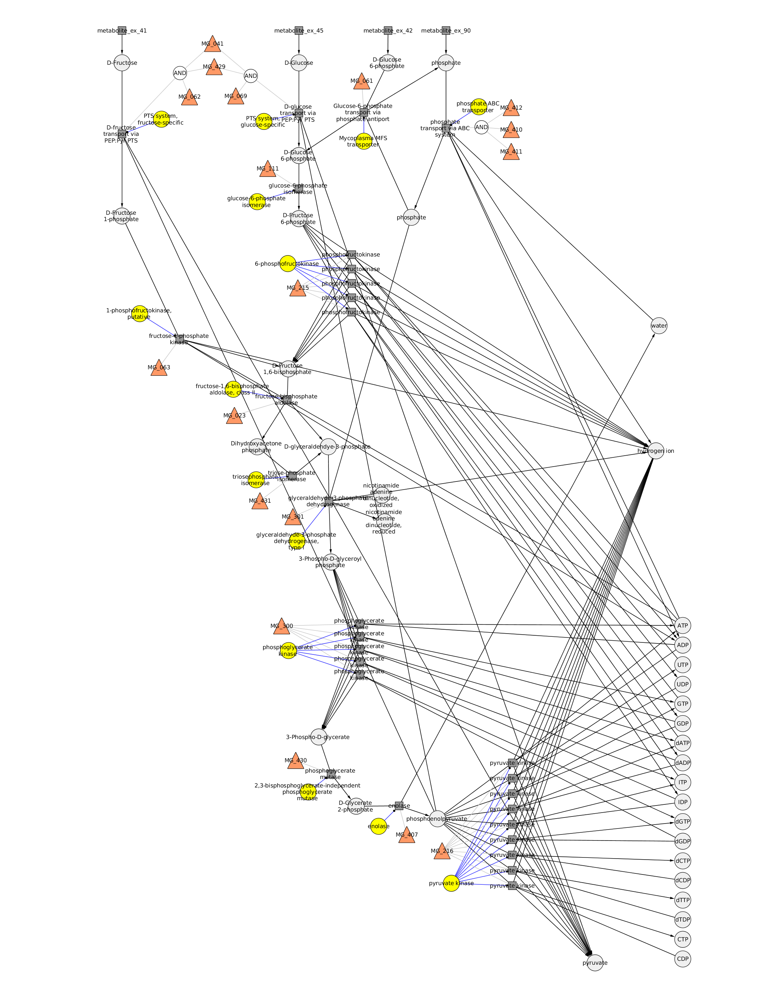
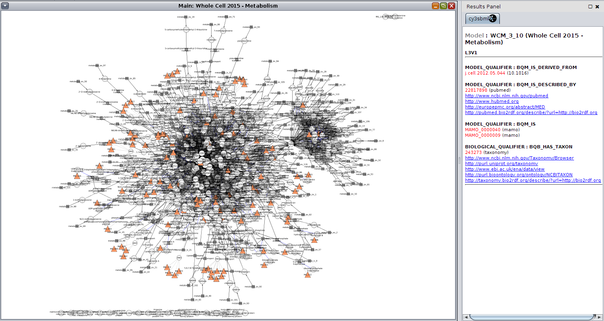

# Metabolism
This page describes how to the metabolism FBA submodules were generated and integrated with other submodels.
Three models were generate, a `full_model` which corresponds to the Karr Matlab code, a `toy_model` as proof of principle for coupling a FBA model to the ODE/SSA models using comp and fbc, and a `glycolysis` model, a subset of the full Karr model corresponding to glycolysis. 
All code and scripts for model generation are available from https://github.com/dagwa/wholecell-metabolism  

# Toy model
A toy model for the coupling of ODE/SSA with FBA simulations was generated using SBML and [FBC v2](http://co.mbine.org/specifications/sbml.level-3.version-1.fbc.version-2.release-1) and [Comp v1](http://co.mbine.org/specifications/sbml.level-3.version-1.comp.version-1.release-3) The toy models were generated with the python bindings to `libsbml` and were simulated using python bindings to `cobrapy` and `libroadrunner`. The python scripts for model generation and simulation are available from https://github.com/dagwa/wholecell-metabolism/tree/master/mkoenig/python/metabolism/toymodel

The model consists of multiple SBML submodels which are coupled via comp

[`toy_comp.xml`](toy_model/toy_comp.xml) : complete ODE/SSA model consisting of  
* [`toy_ode_bounds.xml`](toy_model/toy_ode_bounds.xml) : model for calculating flux bounds
* [`toy_ode_update.xml`](toy_model/toy_ode_update.xml) : model for updating nutrient counts based on FBA fluxes
* [`toy_ode_model.xml`](toy_model/toy_ode_model.xml) : arbitrary ODE/SSA model for demonstrating coupling

[`toy_fba.xml`](toy_model/toy_fba.xml)  : complete FBA model

An overview of the model and a example simulation are provided [here](toy_model/Integrated Toy Model.pdf).

## Simulation ODE/SSA with FBA
The `toy_model` model is simulated by iteratively 
* calculating a step in the ODE/SSA part, which updates the flux bounds and metabolite counts
* sending the flux bounds to the FBA part
* performing FBA with FBA model
* sending the optimal fluxes to the ODE/SSA part

See [toymodel_simulator.py](https://github.com/dagwa/wholecell-metabolism/blob/master/mkoenig/python/metabolism/toymodel/toymodel_simulator.py).

# Glycolysis
A submodel corresponding to glycolysis for the integration of the various submodules. 

The coupling to translation, protein degradation, and protein translocation is performed via the protein counts of the enzymes catalyzing the reactions in glycolysis, namely
```
MG_023_DIMER	fructose-1,6-bisphosphate aldolase, class II
MG_041_062_429_PENTAMER	PTS system, fructose-specific
MG_041_069_429_PENTAMER	PTS system, glucose-specific
MG_061_MONOMER	Mycoplasma MFS transporter
MG_063_DIMER	1-phosphofructokinase, putative
MG_111_DIMER	glucose-6-phosphate isomerase
MG_215_TETRAMER	6-phosphofructokinase
MG_216_TETRAMER	pyruvate kinase
MG_300_MONOMER	phosphoglycerate kinase
MG_301_TETRAMER	glyceraldehyde-3-phosphate dehydrogenase, type I
MG_407_DIMER	enolase
MG_410_411_412_PENTAMER	phosphate ABC transporter
MG_430_MONOMER	2,3-bisphosphoglycerate-independent phosphoglycerate mutase
MG_431_DIMER	triosephosphate isomerase
```
Submodels of the translation, protein degradation, and protein translocation for these proteins have to be generated for the coupling with the glycolysis test model.

# Full model
The annotated SBML was generated from the Matlab source code and the wholecell knowledgebase.

[`Metabolism_matrices_08_L3V1.xml`](full_model/Metabolism_matrices_08_L3V1.xml) : full FBA model  
[`Metabolism_matrices_annotated_08_L3V1.xml`](full_model/Metabolism_matrices_annotated_08_L3V1.xml) : full annotated FBA model



## Model creation
* TODO
 
## Model annotation
* TODO
